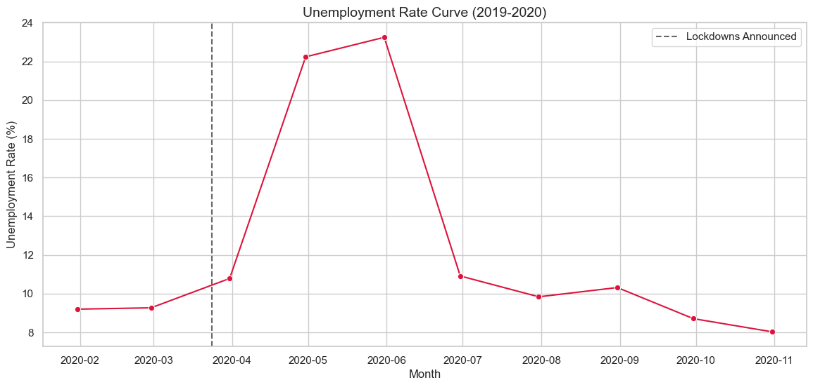
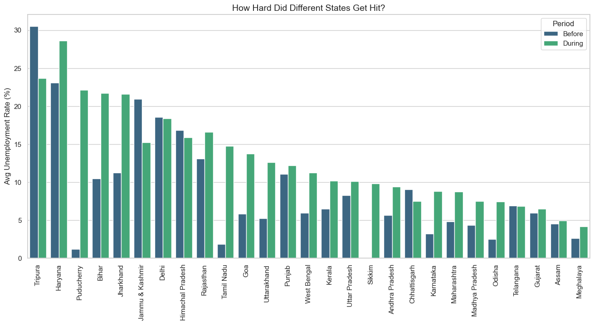

# Unemployment Analysis in India (2019-2020)

Hey there! I put this project together to take a real data-driven look at how unemployment changed in India during the crazy lockdowns of 2020. We all saw the news, but I wanted to see the actual numbers and map out exactly how different states were impacted when everything shut down.

It was a good excuse to practice my Pandas and Matplotlib skills with a real-world messy dataset.

---

## 💾 The Data
I grabbed the [Unemployment in India dataset off Kaggle](https://www.kaggle.com/datasets/gokulrajkmv/unemployment-in-india). Specifically, I used the file containing data running up to November 2020 so I could compare the pre-Covid timeline against the lockdown panic.

---

## 🛠️ Tools I Used
- **Python 3**
- **Pandas** for cleaning up the dates, stripping bad column names, and calculating the averages.
- **Matplotlib & Seaborn** to actually build the charts and make them look clean.
- **Jupyter Notebook** to keep my code and notes together.

---

## 📈 What Did the Numbers Say?

Once I cleaned everything up and did the math, some pretty stark facts jumped out:

1. **The Lockdown Spike:** The average unemployment rate across all the data before March 2020 was sitting around **9.23%**. After lockdowns started? The average shot up to **12.96%**. 
2. **A "Small" Percentage is Huge:** A **3.73%** jump might not sound like a big deal when reading a textbook, but on a national scale, that means millions of people abruptly lost their livelihoods in a matter of weeks.
3. **Unequal Impact:** Not every state suffered equally. **Haryana** took an absolute beating, peaking at an insane **28.58%** average unemployment during the Covid window I measured. Other states barely nudged away from their baseline.

### Visualizing the Damage

Here's the timeline curve. You can see it go almost vertical immediately after the lockdown is announced:



And here is the state-by-state breakdown showing how Haryana spiked, while others didn't move much:



---

## 🗂️ Project Structure

```text
Unemployement_analysis_using_python/
│
├── data/
│   └── Unemployment_Rate_upto_11_2020.csv      <-- Raw dataset
│
├── notebooks/
│   └── unemployment_analysis.ipynb             <-- My actual code and thought process
│
├── images/                                     <-- Exported charts for quick viewing
│   ├── unemployment_trend.png
│   └── state_impact.png
│
├── README.md
├── requirements.txt
└── .gitignore
```

---

## 🚀 How to Run It

If you want to poke around the data yourself:

1. Clone this repo:
   ```bash
   git clone https://github.com/ronoroa1303-sketch/Unemployement_analysis_using_python.git
   ```
2. Move into the folder:
   ```bash
   cd Unemployement_analysis_using_python
   ```
3. Install the tools:
   ```bash
   pip install -r requirements.txt
   ```
4. Fire up Jupyter and open `notebooks/unemployment_analysis.ipynb`:
   ```bash
   jupyter notebook
   ```

---

## 🧠 What I Learned
Honestly, the biggest takeaway wasn't just how to write a `.groupby()` in Pandas. It was seeing how important it is to clean data before trying to plot it (those random spaces in the CSV column headers were driving me crazy). Also, taking raw rows of numbers and turning them into a chart that clearly tells a story is super satisfying.
